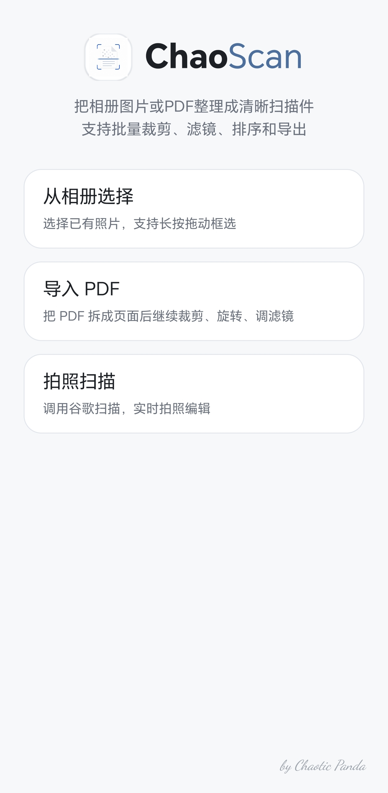
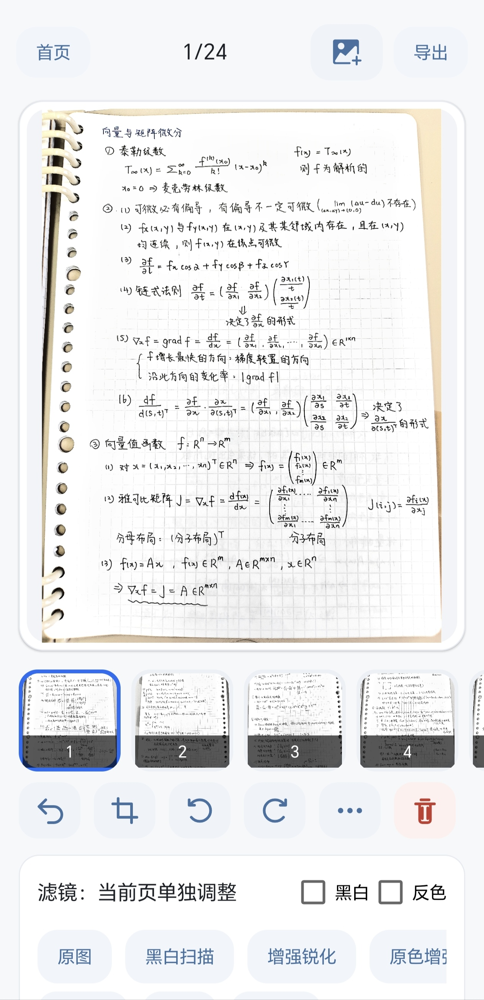

# ChaoScan

[English](README.md) | 简体中文

[](https://github.com/ChaoticPandaisavailable/ChaoScan/releases/download/v1.0.0/ChaoScan-1.0.0.apk)

**最新版 Android APK：** [下载 ChaoScan 1.0.0](https://github.com/ChaoticPandaisavailable/ChaoScan/releases/download/v1.0.0/ChaoScan-1.0.0.apk)

ChaoScan 是一款轻量级 Android 文档扫描应用，用来把照片和 PDF 整理成清晰的扫描件。它重点优化批量处理流程：一次导入多张图片，裁剪、排序、调整扫描滤镜，保存草稿，并导出 PDF/JPG/PNG 文件。

## 截图

| 首页 | 主编辑页 |
| --- | --- |
|  |  |

## 功能

- 从系统相册导入图片，并保留多选顺序。
- 支持长按拖动矩形框选，快速选择大量照片。
- 支持导入 PDF 页面，继续进行裁剪、旋转、滤镜和导出。
- 通过 Google ML Kit Document Scanner 调用拍照扫描入口。
- 支持单页和批量操作：裁剪、智能裁剪、旋转、删除、排序、应用滤镜。
- 面向笔记和文档的扫描滤镜，包括黑白扫描、原色增强、笔记彩色、反色，以及可细调的手动参数。
- 支持多个命名草稿保存。
- 支持导出 PDF、JPG、PNG，并提供页码范围、页面大小、清晰度、进度和预览控制。

## 设计目标

- 保持 APK 体积尽量小。
- 在合适的地方复用成熟 Android/GitHub 库。
- 默认构建不包含 OCR、Tesseract、OpenCV 和大型模型权重。
- 真实暴露解码、渲染、导出错误，不用兜底逻辑掩盖主流程问题。

## 技术栈

- Kotlin
- Android framework views
- Google ML Kit Document Scanner
- PictureSelector
- GPUImage
- Android `PdfDocument`

## 构建

使用 Android Studio 打开项目，等待 Gradle 同步完成后，构建 `app` 模块。

也可以使用本地 Gradle 8.9+ 命令行构建：

```powershell
gradle --no-daemon :app:assembleRelease
```

Release APK 会生成在：

```text
app/build/outputs/apk/release/app-release.apk
```

## 仓库说明

Android SDK 工具、下载的模型实验文件、Gradle 缓存和生成的 APK 等大型本地目录已加入忽略列表。可安装 APK 建议放到 GitHub Releases，不直接提交到仓库。

## 协议

本项目使用 MIT 协议。详情见 [LICENSE](LICENSE)。

## 致谢

Special thanks to [ChrisTinaAmadeus](https://github.com/ChrisTinaAmadeus) for the notes example.
